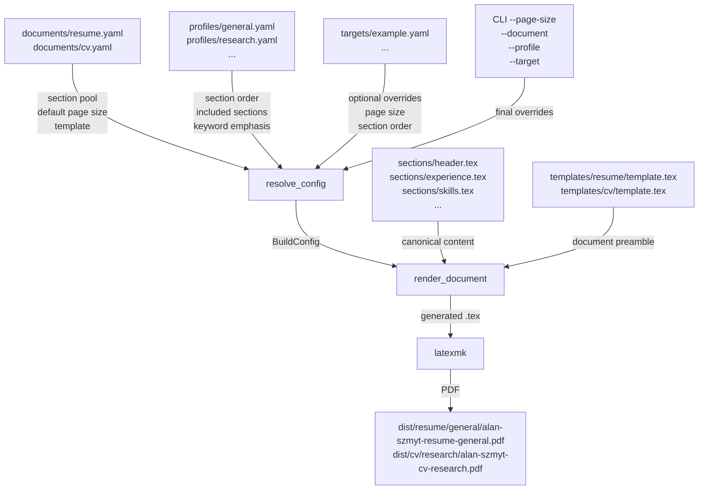

# Career Document Publishing System

A specification-driven, LaTeX-based publishing system that generates résumés and
CVs for Alan Szmyt from **shared canonical career content** without duplicating
source material across variants.

## Architecture overview

Five concepts are kept explicitly separate:

| Concept | Location | Purpose |
|---|---|---|
| Content/evidence | `sections/*.tex` | Canonical career facts shared by all variants |
| Document type | `documents/*.yaml` | résumé vs CV — section pool, template, page-size default |
| Profile | `profiles/*.yaml` | Role-family emphasis — section ordering and inclusion |
| Target | `targets/*.yaml` | Optional application-specific overlay |
| Template/theme | `templates/`, `*.sty` | LaTeX presentation and layout |

Configuration resolution merge order:

```
document manifest defaults
  → profile
  → target overlay
  → CLI overrides (--page-size)
```

### Architecture diagram



---

## Repository structure

```
resume/
├── documents/              # Document type manifests
│   ├── resume.yaml         # Résumé: section pool, defaults
│   └── cv.yaml             # CV: extended section pool, defaults
├── profiles/               # Role-family profile definitions
│   ├── general.yaml
│   ├── platform.yaml
│   ├── research.yaml
│   └── ai-infra.yaml
├── targets/                # Application-specific overlays (optional)
│   └── example.yaml        # Demonstration fixture
├── sections/               # Canonical LaTeX career content (shared)
│   ├── header.tex
│   ├── summary.tex
│   ├── experience.tex
│   ├── publications.tex
│   ├── education.tex
│   ├── skills.tex
│   ├── projects.tex        # CV extension point (empty stub)
│   ├── talks.tex           # CV extension point (empty stub)
│   ├── awards.tex          # CV extension point (empty stub)
│   └── service.tex         # CV extension point (empty stub)
├── templates/              # LaTeX document preamble templates
│   ├── resume/template.tex
│   └── cv/template.tex
├── resume.tex              # Canonical résumé entry point (backward-compat)
├── resume.sty              # Résumé LaTeX style package
├── cv.sty                  # CV LaTeX style package
├── scripts/
│   ├── build.py            # Build CLI and config resolution
│   └── quality_gates.py    # Validation and ATS checks
├── tests/
│   └── test_config.py      # Configuration resolution tests
├── dist/                   # Generated PDF output (not committed)
│   └── resume/general/alan-szmyt-resume-general.pdf
├── specs/
│   ├── resume.spec.md      # Architecture specification
│   └── governance.md       # Repository governance
└── .github/
    ├── copilot-instructions.md
    └── workflows/
        └── build-resume.yml
```

---

## Building

### Prerequisites

- TeX Live 2023+ (with `latexmk` and standard LaTeX packages)
- Python 3.11+
- `pyyaml` (`pip install pyyaml`)

### List available documents, profiles, and targets

```bash
python scripts/build.py --list
```

### Build a résumé

```bash
python scripts/build.py --document resume --profile general
python scripts/build.py --document resume --profile research
python scripts/build.py --document resume --profile platform
python scripts/build.py --document resume --profile ai-infra
```

### Build a CV

```bash
python scripts/build.py --document cv --profile research
python scripts/build.py --document cv --profile general
```

### Build with A4 page size

```bash
python scripts/build.py --document resume --profile general --page-size a4
python scripts/build.py --document cv --profile research --page-size a4
```

### Build with an application-specific target overlay

```bash
python scripts/build.py --document resume --profile general --target example
```

### Backward-compatible invocation (defaults to résumé)

```bash
python scripts/build.py --profile general
```

### Output paths

Generated PDFs are written to `dist/` with deterministic, collision-resistant paths:

```
dist/<document_type>/<profile>/alan-szmyt-<document_type>-<profile>.pdf
dist/<document_type>/<profile>/<target>/alan-szmyt-<document_type>-<profile>-<target>.pdf
```

Examples:
```
dist/resume/general/alan-szmyt-resume-general.pdf
dist/resume/research/alan-szmyt-resume-research.pdf
dist/cv/research/alan-szmyt-cv-research.pdf
dist/resume/general/example/alan-szmyt-resume-general-example.pdf
```

Backward-compatible copies are also written to `outputs/` for tooling that
expects the old path.

---

## Quality gates

```bash
# Validate document manifests
python scripts/quality_gates.py validate-documents

# Validate profile definitions
python scripts/quality_gates.py validate-profiles

# Scan for unresolved placeholder content
python scripts/quality_gates.py check-placeholders

# Validate ATS text extraction from a generated PDF
python scripts/quality_gates.py validate-ats \
  --pdf dist/resume/general/alan-szmyt-resume-general.pdf
```

### Tests (no LaTeX required)

```bash
pip install pytest pyyaml
python -m pytest tests/ -v
```

Tests cover: configuration resolution, section ordering, overlay precedence,
section pool validation, error handling, and output naming.

---

## How to extend the system

### Add a new role profile

1. Create `profiles/<name>.yaml` following the schema in `specs/resume.spec.md`.
2. Add `section_order`, `included_sections`, and `keyword_emphasis`.
3. Run `python scripts/quality_gates.py validate-profiles`.
4. Build: `python scripts/build.py --document resume --profile <name>`.

### Add a new application target overlay

1. Create `targets/<name>.yaml` with only what is application-specific:
   page size, section order, output basename, etc.
2. Build: `python scripts/build.py --document resume --profile general --target <name>`.
3. Targets do **not** duplicate career content — they override configuration only.

### Add an optional CV section

1. Create `sections/<name>.tex` with the section content.
   New CV sections start as empty stubs (see `sections/projects.tex`).
2. Add the section name to `documents/cv.yaml` → `section_pool`.
3. Add it to a profile's `section_order` **and** `included_sections` to activate it.
4. The build system omits sections not in `included_sections` — no empty headings.

### Add or modify a template

1. Edit `templates/<document_type>/template.tex` and/or the corresponding `.sty` file.
2. The template uses `{{PAGE_CLASS}}`, `{{DOCUMENT_TITLE}}`, `{{DOCUMENT_SUBJECT}}`,
   and `{{PDF_KEYWORDS}}` placeholders that the build system substitutes.
3. **Do not modify career content (`sections/*.tex`) as part of a template change.**

### Build letter vs A4

Page size is selected independently of content:

```bash
python scripts/build.py --document resume --profile general --page-size letter
python scripts/build.py --document resume --profile general --page-size a4
```

---

## Profiles

| Profile | Intended roles |
|---|---|
| `general` | General software engineering |
| `platform` | Platform engineering, DevOps, SRE |
| `research` | Research, academic, applied science |
| `ai-infra` | AI/ML infrastructure, MLOps |

---

## Document types

| Document | Description | Section pool |
|---|---|---|
| `resume` | Concise, ATS-safe, single-column | `header`, `summary`, `experience`, `publications`, `education`, `skills` |
| `cv` | Multi-page, research-friendly | All résumé sections + `projects`, `talks`, `awards`, `service` |

---

## Specification

See [`specs/resume.spec.md`](specs/resume.spec.md) for the full architecture
specification and configuration schema.

See [`specs/governance.md`](specs/governance.md) for repository publication,
audit, and artifact governance workflows.

See [`.github/copilot-instructions.md`](.github/copilot-instructions.md) for
Copilot agent instructions and source-of-truth rules.

---

## License

Apache-2.0
