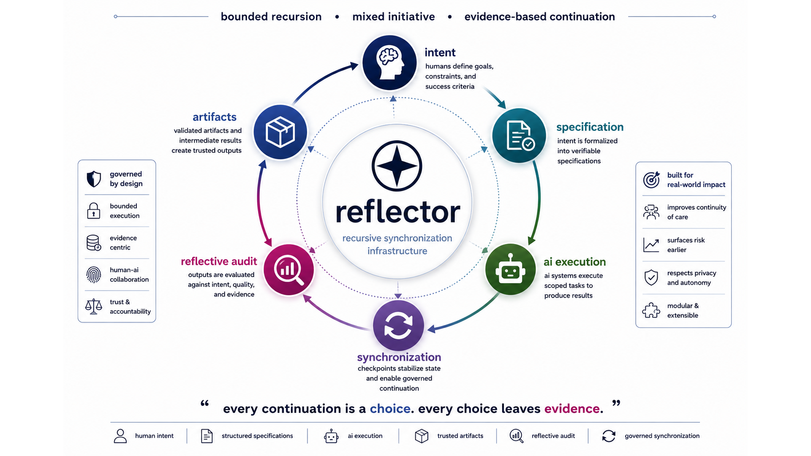

# reflector

> Reflective synchronization systems for recursive AI-assisted software engineering.

[](./pyproject.toml)
[](./LICENSE)
[](./REUSE.toml)
[](./ROADMAP.md)
[](./paper/README.md)

[](https://github.com/egohygiene/reflector/actions/workflows/build-paper.yml)
[](https://github.com/egohygiene/reflector/actions/workflows/pages.yml)
[](https://github.com/egohygiene/reflector/actions/workflows/reuse.yml)
[](./specs/publication/arxiv-publication.spec.md)
[](./docs/huggingface.md)
[](https://doi.org/10.5281/zenodo.20477044)



## What is reflector?

reflector is an open-source research repository and recursive engineering platform for studying how AI-assisted software systems can stay aligned, auditable, and governable as they iterate. The repository combines:

- a research manuscript in `paper/`
- a synchronization-oriented CLI in `reflector/`
- deterministic publication workflows in `scripts/` and `.github/workflows/`
- specification contracts in `specs/`
- a GitHub Pages publication surface in `docs/`

If you want the short version: reflector treats recursive development as a systems problem, not just a prompting problem.

## Why it exists

Recursive AI workflows can move faster than humans can inspect them. reflector exists to make those workflows easier to reason about by introducing bounded execution, explicit checkpoints, inspectable metadata, and publication-grade traceability.

## Core concepts

| Concept | Meaning in reflector |
| --- | --- |
| Recursive Drift | Failure modes that emerge when recursive optimization loops move away from human intent. |
| Reflective Auditing | Continuous validation of state, artifacts, and workflow contracts against declared invariants. |
| Synchronization Checkpoints | Explicit handoff boundaries where human review or deterministic validation can gate progress. |
| Human Governance | The repository treats human oversight as a first-class systems constraint, not an afterthought. |
| Mixed-Initiative Systems | Humans, automation, and AI agents collaborate through bounded, reviewable execution layers. |

## How reflector works

```text
semantic content and metadata
            ↓
specifications and synchronization contracts
            ↓
audits, validation, and milestone checkpoints
            ↓
publication orchestration and deployment
            ↓
repeatable artifacts for research, review, and release
```

The repository architecture is intentionally layered:

- **Content** — manuscript sections and semantic paper structure in `paper/sections/`
- **Metadata** — canonical publication and repository metadata in `paper/macros/` and `metadata/`
- **Style** — renderer-facing presentation assets in `paper/styles/`
- **Orchestration** — build, audit, and deployment logic in `scripts/`, `reflector/`, and `.github/workflows/`

## Quick start

### Recommended local workflow

reflector's canonical developer workflow uses [`task`](https://taskfile.dev/) with [`uv`](https://docs.astral.sh/uv/):

```bash
task setup
task doctor
task test
task examples
```

### Direct Python fallback

If you do not use `task` or `uv`, you can still install the repository directly:

```bash
python -m pip install -e '.[dev,huggingface]'
reflector --version
reflector huggingface --check-sdk
```

### Build the paper

```bash
./scripts/build-paper.sh paper
```

To publish a locally built PDF into `docs/`:

```bash
./scripts/build-paper.sh paper --publish
```

### Build the visual magazine artifact

```bash
task magazine:doctor
task magazine:build
task magazine:build:print
```

See [`magazine/README.md`](./magazine/README.md) for the full workflow and output paths.

## Repository map

| Need | Start here |
| --- | --- |
| Canonical onboarding | [`00-README.md`](./00-README.md) |
| Repository architecture | [`docs/architecture-overview.md`](./docs/architecture-overview.md) |
| Publication architecture | [`docs/publication-architecture.md`](./docs/publication-architecture.md) |
| Workflow overview | [`docs/workflows.md`](./docs/workflows.md) |
| Toolchain requirements | [`docs/toolchain.md`](./docs/toolchain.md) |
| Paper overview | [`paper/README.md`](./paper/README.md) |
| Magazine overview | [`magazine/README.md`](./magazine/README.md) |
| Publication specs | [`specs/publication/`](./specs/publication/) |
| Research notes | [`docs/research/`](./docs/research/) |
| Roadmap | [`ROADMAP.md`](./ROADMAP.md) |

## Research paper and publication links

- GitHub Pages landing page: <https://egohygiene.github.io/reflector/>
- Canonical PDF route: <https://egohygiene.github.io/reflector/reflector.pdf>
- DOI (canonical version DOI): <https://doi.org/10.5281/zenodo.20477044>
- DOI (Zenodo concept DOI): <https://doi.org/10.5281/zenodo.20477045>
- Citation metadata: [`CITATION.cff`](./CITATION.cff)
- CodeMeta metadata: [`codemeta.json`](./codemeta.json)
- Publication metadata: [`publication.json`](./publication.json)
- Paper source and section status: [`paper/README.md`](./paper/README.md)
- arXiv-oriented publication spec: [`specs/publication/arxiv-publication.spec.md`](./specs/publication/arxiv-publication.spec.md)

## Citation

Use the version DOI when citing a specific archived release:

> 10.5281/zenodo.20477044

`CITATION.cff` is the canonical machine-readable citation source for GitHub and downstream tooling.

## Publication

- Release metadata and DOI synchronization contract: [`release-manifest.json`](./release-manifest.json)
- Release workflow and DOI lifecycle: [`docs/release-process.md`](./docs/release-process.md)
- Publication infrastructure details: [`docs/publication-infrastructure.md`](./docs/publication-infrastructure.md)

## Hugging Face readiness

reflector is not publishing to Hugging Face yet, but it is now structured to make that step straightforward later:

- canonical repository metadata already includes a Hugging Face integration surface in [`metadata/repository.yaml`](./metadata/repository.yaml)
- the CLI exposes `reflector huggingface` for scaffold inspection
- recommended publication and mirroring strategy is documented in [`docs/huggingface.md`](./docs/huggingface.md)
- a future-facing card scaffold is available in [`README_HF.md`](./README_HF.md)

## Contributing and project governance

- Contribution guide: [`CONTRIBUTING.md`](./CONTRIBUTING.md)
- Code of conduct: [`CODE_OF_CONDUCT.md`](./CODE_OF_CONDUCT.md)
- Security policy: [`SECURITY.md`](./SECURITY.md)
- Support guide: [`SUPPORT.md`](./SUPPORT.md)
- Citation guidance: [`CITATION.cff`](./CITATION.cff)

## Long-term vision

reflector aims to become a durable reference architecture for recursive engineering systems: publication-aware, specification-driven, synchronization-first, and legible to both humans and automation. The near-term roadmap is to complete the manuscript, harden the audit and release paths, and prepare clean distribution surfaces for arXiv, GitHub Pages, and future Hugging Face publication.
