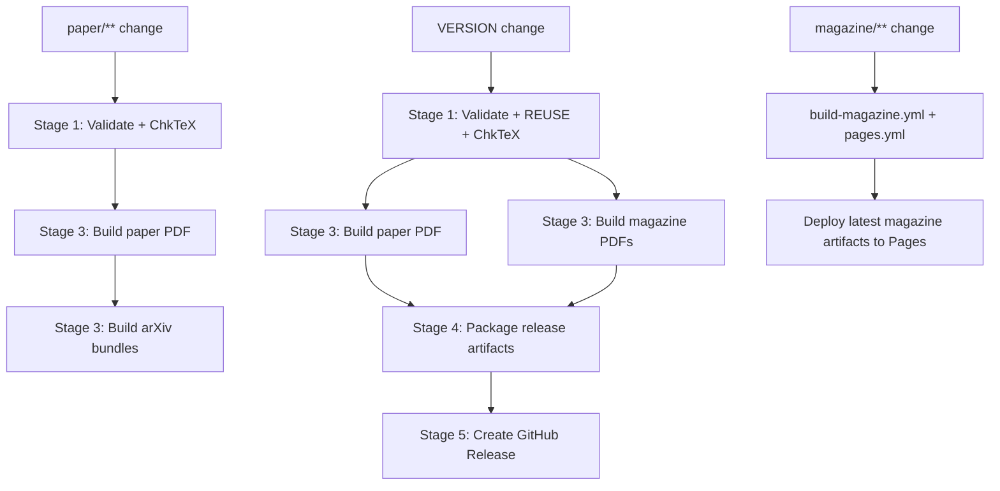
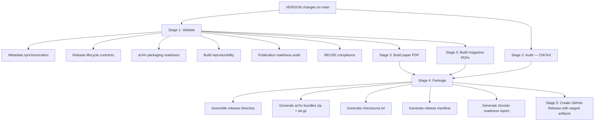

# Workflow Overview

This document summarizes the primary workflows in reflector.

## 1) Section Writing Workflow

1. Edit semantic section files under `paper/sections/`.
2. Keep manuscript semantics independent from style-specific concerns.
3. Build and review output via existing build pipeline.

## 2) Figure Workflow

1. Manage figure identity/state in `paper/figures/manifest.md`.
2. Preserve recursive prompt history in `paper/figures/prompts/*.prompt.md`.
3. Keep canonical captions in `paper/figures/captions.md`.
4. Keep LaTeX placements and labels synchronized in `paper/sections/*.tex`.
5. Run `python3 scripts/audit-publication-readiness.py` after figure changes.

## 3) Publication Workflow

1. Resolve canonical source and metadata.
2. Build via `scripts/build-paper.sh`.
3. Validate output and synchronization artifacts.
4. Publish/deploy through configured CI workflows.

## 4) Placeholder Replacement Workflow

1. Update the figure prompt file with the latest iteration context and checkpoint notes.
2. Replace placeholder asset while preserving canonical filename/dimensions.
3. Update figure state metadata (`placeholder` → `final`) in the manifest.
4. Reconcile captions/placement metadata if needed.
5. Re-run publication readiness audit.

Canonical lifecycle:

`Placeholder Figure → Prompt Iteration → Candidate Figure → Synchronization Review → Final Publication Figure`

Synchronization review checkpoints:
- Prompt file updated
- Manifest state synchronized
- Caption/label alignment verified
- Publication audit passes

## 5) Synchronization Audit Workflow

1. Run audit tooling from `scripts/` (including publication-readiness checks).
2. Verify references, figures, and metadata alignment.
3. Resolve drift before publication/release steps.

## 6) Pages Deployment Workflow

1. CI builds publication artifacts.
2. Deployment workflow publishes repository-backed output to GitHub Pages.
3. Published surface remains traceable to repository source and metadata.

## 7) Publication Manifest Workflow

1. Use publication metadata/manifests as explicit orchestration contracts.
2. Keep source declaration and output expectations deterministic.
3. Maintain reproducibility by avoiding hidden build assumptions.

## 8) Local GitHub Actions Workflow

1. Use `act` with the repository `.actrc` defaults for deterministic local execution.
2. Run `act --list` to inspect available local jobs.
3. Prefer testing synchronization and build workflows locally before pushing.
4. Use hosted GitHub Actions for deployment/release workflows requiring cloud permissions.

## 9) Publication Orchestration Workflow

The canonical publication entry point is:

```
.github/workflows/publication.yml
```

This workflow now applies artifact-aware scope detection to support incremental rebuilds:



Scope behavior:

- `paper/**` changes rebuild paper + arXiv publication bundles (without release packaging).
- `VERSION` changes trigger full publication packaging and GitHub Release creation.
- `magazine/**` changes are handled by the magazine and Pages workflows without rebuilding paper artifacts.

The full release path remains deterministic:



Zenodo-ready assets remain part of the Stage 4 package output (checksums,
manifest, and readiness report) and are carried forward into the release stage.

Full documentation:

- [`docs/release-process.md`](release-process.md)
- [`docs/publication-infrastructure.md`](publication-infrastructure.md)

## 10) Automated Release Lifecycle Workflow

Canonical release version source: `VERSION`.

All release version surfaces derive from `VERSION` and are validated by:

- `scripts/validate-metadata.py`
- `scripts/validate-release-lifecycle.py`

The publication workflow (section 9 above) is the canonical release lifecycle.
The following independent workflows continue to provide focused checks:

- `.github/workflows/release-tag.yml` — VERSION-driven annotated tag creation
- `.github/workflows/release-paper.yml` — tag-triggered release build (legacy entry point)
- `.github/workflows/synchronization.yml` — continuous synchronization validation
- `.github/workflows/paper-quality.yml` — continuous ChkTeX quality checks

## Reusable Blueprint Specs

- `specs/workflows/recursive-issue-orchestration.spec.md`
- `specs/workflows/recursive-workflow-blueprints.spec.md`
- `specs/workflows/figure-pipeline.spec.md`
- `specs/synchronization/synchronization-layer.spec.md`
- `specs/repositories/publication-repository.spec.md`

## Publication Reference Documentation

- [`docs/publication-system-reference.md`](publication-system-reference.md) — authoritative end-to-end publication lifecycle
- [`docs/publication-workflow-reference.md`](publication-workflow-reference.md) — workflow registry, triggers, ownership, dependencies
- [`docs/publication-artifact-reference.md`](publication-artifact-reference.md) — artifact lifecycle, producers, consumers, destinations
- [`docs/publication-lessons-learned.md`](publication-lessons-learned.md) — lessons learned and future recommendations
