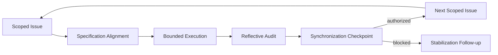
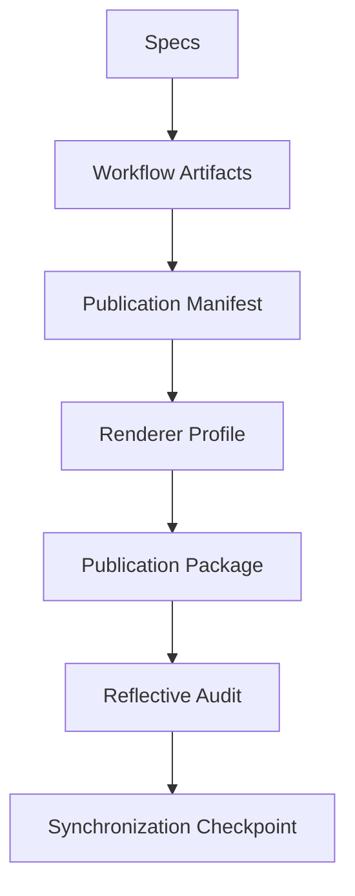

# Synchronization Diagram Examples

## Recursive Synchronization Loop

```mermaid
flowchart LR
    A[Scoped Issue] --> B[Specification Alignment]
    B --> C[Bounded Execution]
    C --> D[Reflective Audit]
    D --> E[Synchronization Checkpoint]
    E -->|authorized| F[Next Scoped Issue]
    E -->|blocked| G[Stabilization Follow-up]
    F --> A
```

## Publication Rendering Pipeline

```mermaid
flowchart TD
    S[Specs] --> W[Workflow Artifacts]
    W --> M[Publication Manifest]
    M --> R[Renderer Profile]
    R --> P[Publication Package]
    P --> A[Reflective Audit]
    A --> C[Synchronization Checkpoint]
```
